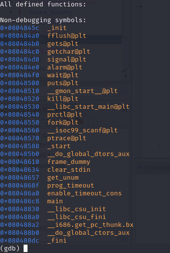
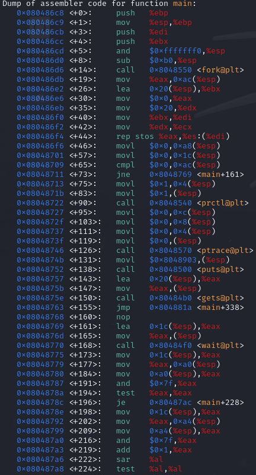
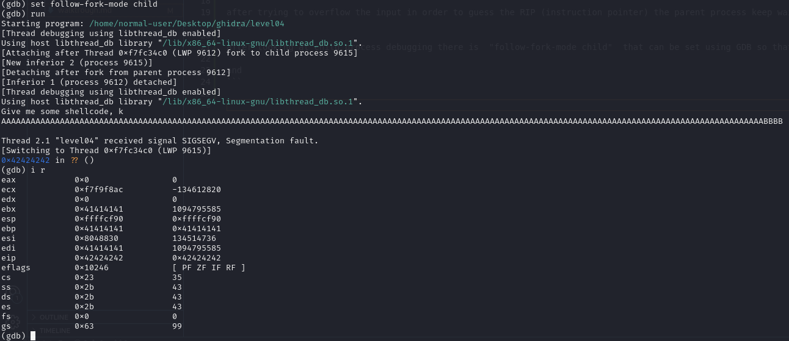

```
no specific protections preventing us from looking at the functions compiled with the program
```


```
looking at the main function assembly it  makes a call to fork() then child is asking input from the user using gets() that doesnt control the length of the input
this input is meant to be stored into an array of 32 byte


the parent is waiting for the child process to be finished
the child process is ussing the ptrace() with PTRACE_TRACEME so that it is expecting the parent call for ptrace() on the pid of the child using  PTRACE_PEEKUSER
```



```
after trying to overflow the input in order to guess the RIP (instruction pointer) the parent process keep waiting and i couldnt figure out the address of the segfault

after looking at child process debugging there is  "follow-fork-mode child"  that can be set using GDB so that it can follow the child process execution 
```


```
lets try to look for a stack shell code injection or a return2libc scenario first by exploiting the Instruction pointer and guide it to some other memory area than returning to the expected caller function

using gdb we can get the  address of the functions system() , exit() during the program runtime

and the string "/bin/sh" to pass it as argument to system

and construct our payload, we already defined the offset of the instruction pointer so we already know where to inject our payload
```

