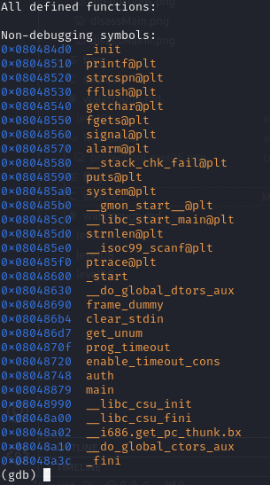
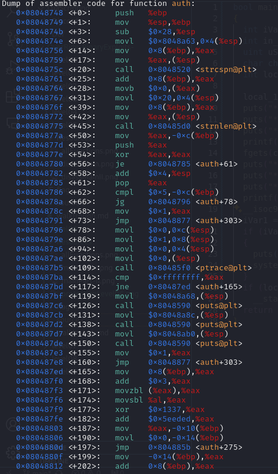
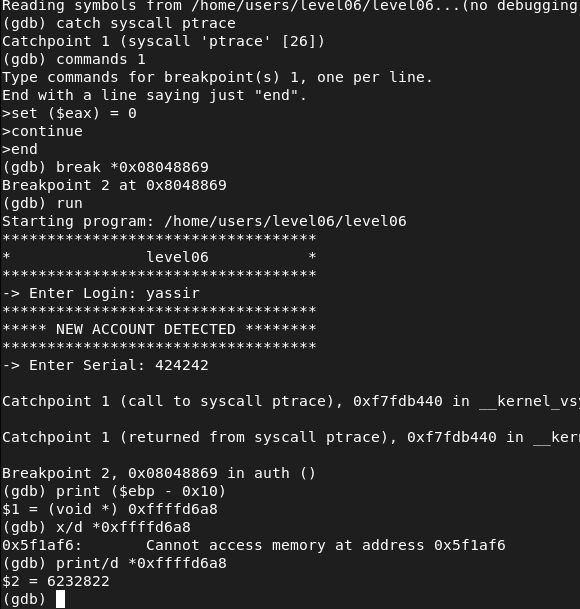

```
looking at the program protection's we can see the canary value is set to the program so we cant write to the stack and also the Nx is enabled which protect some memory area from code execution stored data cannot be executed as code
```
```
Running the program it asks us for a login and a serial value
```




```
Let's disassemble the main function
```


```
looking at the main function it makes a call to a function auth then checks on its return value stored in a variable,
 if it equals 0 it makes a call to system 
```
```
Let's Disassemble the auth function and look at its logic
```



```
Apperently the program takes our login input then it makes some serialization to it then compare the serialized output with the second input/serial we fed to the program

so basically if we give the correct serialized value for our input login it will accept it and make a call to the function system

using GDB i cannot set a breakpoint at the part where there is comparaison between the generated serialized value and my input. after searching internet we can use

catch syscall ptrace
commands 1
set $(eax) = 0
continue
end

then we can catch our breakpoint normally then we can check using the basepointer the value of the adress were the comparaison is done


```

```
the serial value calculated for our input "yassir" will be 6232822.
```