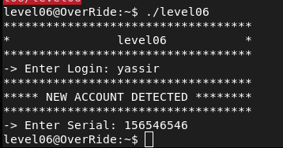
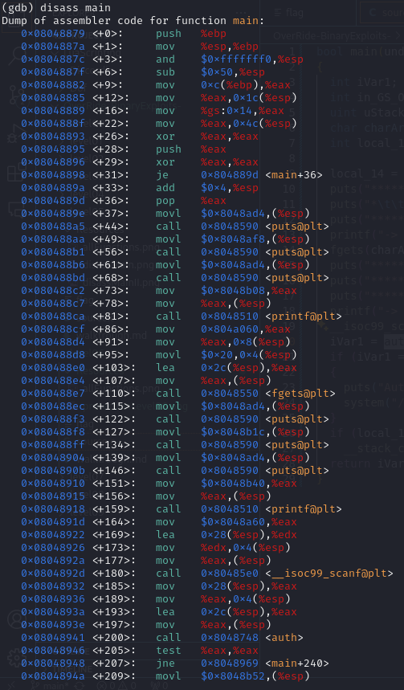
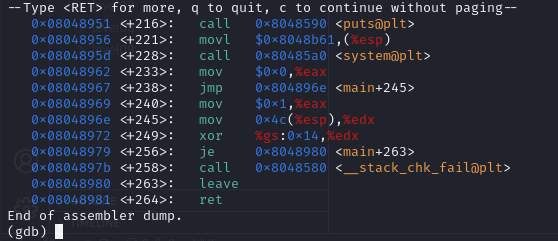

```
looking at the program protection's we can see the canary value is set to the program so we cant write to the stack and also the Nx is enabled
```
```
Running the program it asks us for a login and a serial value
```



```
Let's disassemble the main function
```



```
looking at the main function it makes a call to a function auth then checks on its return value stored in a variable,
 if it equals 0 it makes a call to system 
```
```
Let's Disassemble the auth function and look at its logic
```


```
Apperently the program takes our login input then it makes some serialization to it then compare the serialized output with the second input/serial we fed to the program

so basically if we give the correct serialized value for our input login it will accept it and make a call to the function system

the serial value calculated for our input "yassir" will be .
```