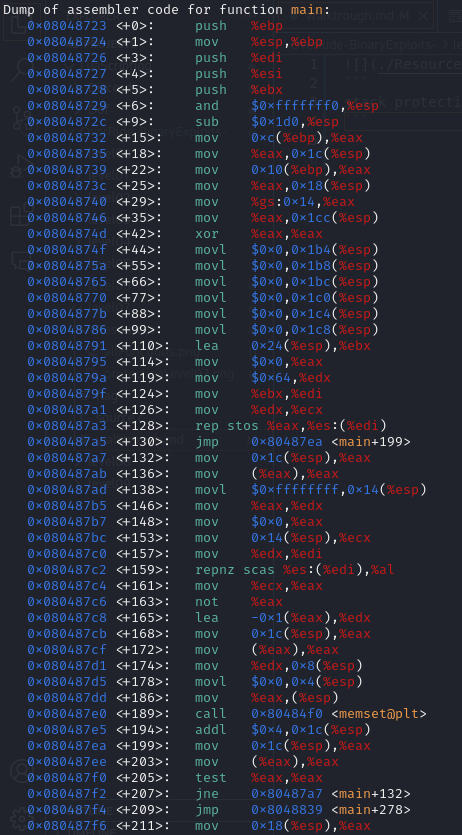
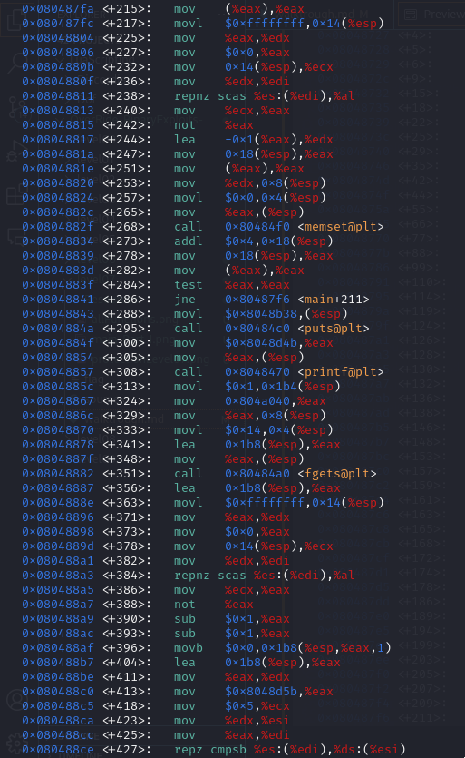
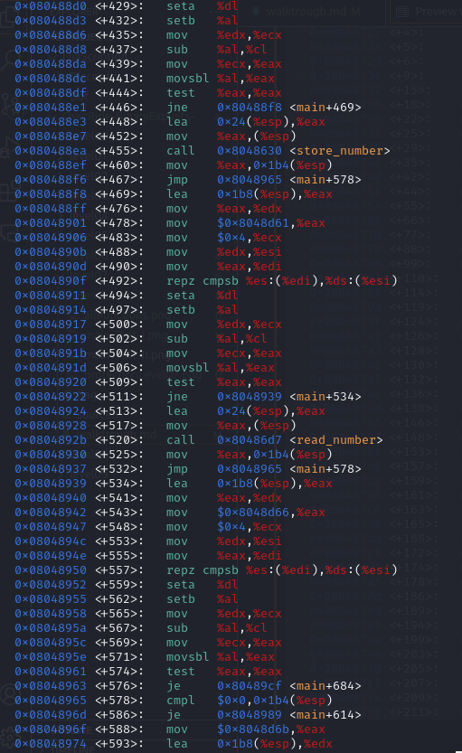
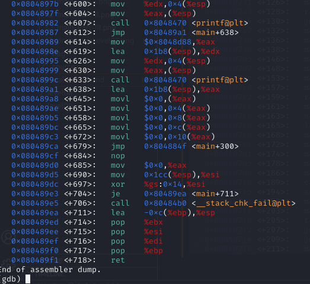

```
stack protection canary value is enabled so we cannot write in to the stack
```


```
Let's Disassemble the main
```






```
as we can confirm initialy the program give 3 commands store , read  data at chosen index then we can fetch that data

and quit to exit the program

let's disassemble those functions
```


```
the function get_unum is called whenever it need to store our input
```


```
we cannot store our numbers in index's that are multiple of 3 , 

if we can get the offset of the instruction pointer we will try a ret2libc 

lets gets the address of the Array tab at index 0

x/x ($ebp + 0x8)
0xffffd530:	0xffffd554

(0xffffd530) : the address where the address of the tab array is stored
(0xffffd554) : the address of the tab array itself

Let's calculate what is the index where the address of the tab is stored in the tab array itself 
0xffffd530 - 0xffffd554 = -0x24 (-36 in decimal)

-36 / 4 = -9


We need to figure out the address of the IP in the read_number function : 
Lets break at (*main+520) and check the stack frame.

In this stack frame, the address of the instruction pointer is 0xffffd71c. Find the addres by calculating the difference between the tab address and the EIP address like before

0xffffd71c - 0xffffd554 = 456

456 / 4 = 114


but we cannot store anythin at the index 114 because it is protected we will have to access it using the overflow 
the arithmetic is ((UINT_MAX  / 4) + 114)

((4294967296 / 4) + 114) = 1073741938


the address of system() is : 0xf7e6aed0 contverted to Decimall it will be : 4159090384 

the address of "/bin/sh" is : 0xf7f897ec converted to Decimal it will be : 4160264172
```
