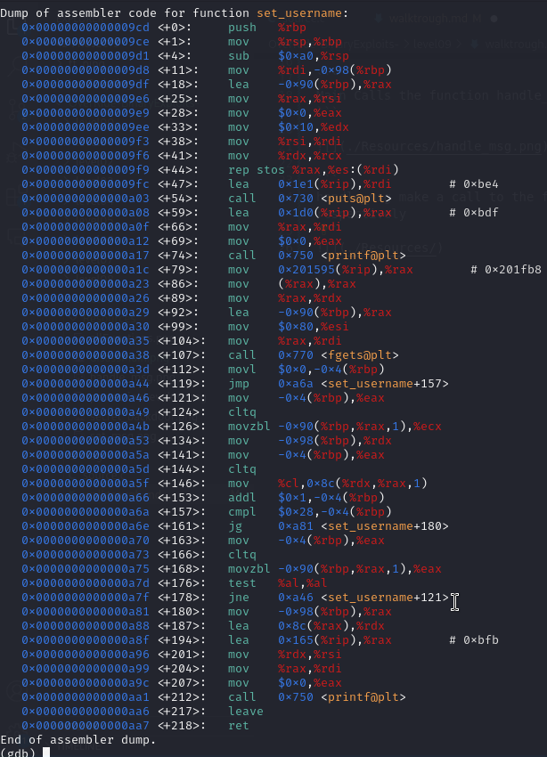

```
We Have the PIE (position independant executable) enabled which means every time we will execute the program it will load in a different memory area 

The NX is also enabled which means that we cannot execute code on some memory area's using our stored data as code
```


```
the program is using set_username , set_msg, handle_msg, secret_backdoor

Let's Disassemble the main 
```


```
Main Calls the function handle_msg
```


```
handle_msg make a call to the functions set_username and set_msg respectively
```



```
we know that the size of the input in the username is set to 41 bytes and the array only 40 bytes so basically we will be overriding the content of the variable comming after the array in the stack which is a length variable , so know we need to figure out the offset for the instruction pointer in order to inject the address of secret_backdoor

to override the instruction pointer, we need to write a username of 40 characters + the length to overflow + a newline for the next input + the padding till the IP then the address of system  : (sizeof(struct s_mail) + padding + old ebp + old eip), use a newline for the end of the buffer, fill the memory until the new address of old eip.

(python -c "print 'A' * 40 + '\xff'+ '\n' + 'A' * 200 + '\x8c\x48\x55\x55\x55\x55\x00\x00' + '\n' + '/bin/sh'"; cat) | ./level09
```